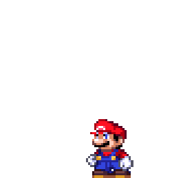

## Hi, dear reader! 
Hey! My name is Lucas Gomes de Souza. I am a second-year Computer Engineering undergraduate student at the Federal University of Rio Grande do Sul (UFRGS).

I have hands-on interests when talking about technology and learning the challenges tangent to it.

## About me! :arrow_down: :mouse: 
- 🔭 I’m currently uploading my personal/university projects here on Github;<ul>
<li style="display: flex; align-items: left;"> 🌱 I’m currently learning HTML, CSS, C# and database;</li></ul>

## :computer: Skills 

